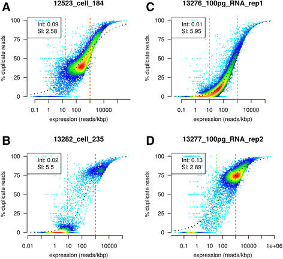

# dupRadar publication

The manuscript describing the [bioConductor](http://bioconductor.org) package [dupRadar]( http://bioconductor.org/packages/dupRadar/) has been accepted to BMC Bioinformatics and is [available online](https://bmcbioinformatics.biomedcentral.com/articles/10.1186/s12859-016-1276-2) with open access.

*dupRadar* is a software to distinguish the fraction of reads originating in natural duplication due to high expression from the fraction induced by artefacts.

<p align="center">
  
</p>

It's available from the [bioConductor project](http://bioconductor.org/packages/dupRadar/) and installed from the `biocLite` script. It requires R>=3.2 and runs on Linux or MacOS X (no Windows).

```r
source("http://bioconductor.org/biocLite.R")
biocLite("dupRadar")
```

***Citation:*** Sergi Sayols, Denise Scherzinger and Holger Klein. *dupRadar: a Bioconductor package for the assessment of PCR artifacts in RNA-Seq data*. BMC Bioinformatics. 2016, 17:428. DOI: 10.1186/s12859-016-1276-2.