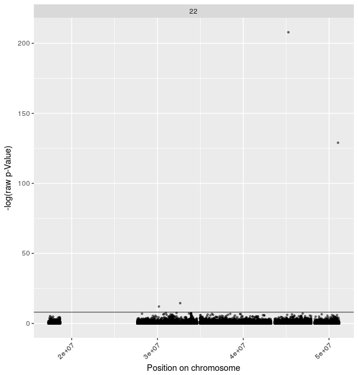
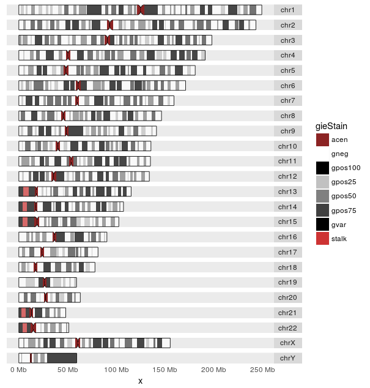
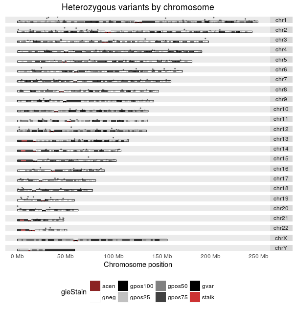

# Ideograms in R with ggplot2

### Introduction

Ideograms show the chromosomes of a selected genome with a nice banding pattern that has been yielded from different staining techniques in "real" wetlab biological experiments.
The banding pattern shows regions of condendensed and open DNA.
In bioinformatics this makes for a good representation of chromosomes compared to dull x-axis counting from 0Mb to end of chromosome.


<div class="captionheader">Figure 1:<div class="caption">p-values plotted along chromosomes as plain x-axis coordinates. A rather sad view, though the values are plotted well.</div></div>

An ideogram would be a nice addition to make the x-axis more fancy and in addition stack the chromosomes more tightly instead of using `facet_wrap` from the ggplot2 package.


<div class="captionheader">Figure 2:<div class="caption">Chromosomes depicted as ideograms.</div></div>

To plot data, e.g. coverage tracks or calculated p-values, along the genome one needs to add the respective track of information to the ideogram.

### Solution - first steps

For a beginning one could follow the Biostars question of Alexander Skates (https://www.biostars.org/p/152969/).
This will guide you through the setup of the respective data frames and `GenomicRanges` object.

First setup your R session to know about the right packages.

```R
library("ggbio")
library("GenomicRanges")
require("biovizBase")

# some test data
CHROM    POS  fisher_het
1:    10 134775 0.299587633
2:    10 135237 1.000000000
3:    10 135277 0.483198279
4:    10 135331 0.224587437
5:    10 135334 0.068035761
6:    10 135656 0.468998144
7:    10 135708 0.746611845
8:    10 135801 0.242257762
9:    10 135853 0.001234701
10:    10 137186 0.774670848
```

Now we need to setup the object containing the banding pattern and a `GRanges` object to contain your data.

```R
# load banding data
data(hg19IdeogramCyto, package = "biovizBase")
hg19 <- keepSeqlevels(hg19IdeogramCyto, paste0("chr", c(1:22, "X", "Y")))

# create a test GRanges object
# from the test data given above
test.granges <- GRanges(seqnames = paste0("chr", df.test.data$CHROM),
                        ranges=IRanges(start = df.test.data$POS,
                                       end = df.test.data$POS),
                        strand = "*",
                        fisher_het = df.test.data$fisher_het)

# attach chromosome lengths
data(hg19Ideogram, package = "biovizBase")
seqlengths(test.granges) <- seqlengths(hg19Ideogram)[names(seqlengths(test.granges))]

```

### Solution - the final steps

The solution of Alexander Skates is only short by a few meters, if one wants to add a second track of data to the ideograms and doesn't really know how to handle `GenomicRanges` objects like me.
Luckily there's help underway found here http://www.tengfei.name/ggbio/docs/man/layout_karyogram-method.html.
The critical part here is that it points out how to use the `GRanges` object correctly and use the coordinates stored in the object using `start`.
And there we go.

- the x-coordinate from the `GRanges` object to be used would be `start`
- `ylim` defines the size of the point-subplots
    - play around with those scales, if you - for example - want to shift the lower points behind the ideograms
- `size` needs to be reduced a little as default point size would produce a nearly unreadable plot
- `geom` can contain anything that `ggplot2` would understand as `geom_...`

```R
ggplot(hg19) +
     layout_karyogram(cytoband = TRUE) +
     layout_karyogram(data = test.granges,
                      geom = "point",
                      aes(x=start, y=fisher_het),
                      ylim = c(10,50),
                      color = "black",
                      size = 0.4
                      )
```


<div class="captionheader">Figure 3:<div class="caption">p-values plotted along chromosomes depicted as ideograms. The exact values shown as points cannot be well read though.</div></div>

### Discussion

The process of finding this solution can be found in a [Stackoverflow post](https://stackoverflow.com/questions/44003072/annotate-karyogram-with-granges-track/44043471#44043471).   
This plot gives a good overview of your data along the chromosomes to show where there might be significant peaks and bumps in your data.
The scale of the y-axis is a bit lost and if one is interested in this one may need to resort to the dull plot in figure 1 or find a better way to add tracks to ideograms, which I would gladly add here.

### Supplements

PS: The R code to produce figure 1 and 2

```R
# figure 1

ggplot(data = my.data.frame,],
       aes(POS, -1 * log(fisher_het))
       ) +
    geom_point(alpha = 0.5, size = 0.8) +
    facet_wrap(~ CHROM) +
    labs(x = "Position on chromosome", y = "-log(raw p-Value)") +
    theme(axis.text.x = element_text(angle = 45, hjust = 1)) +
    geom_hline(yintercept = 8, size = 0.3)

# figure 2

ggplot(hg19) + layout_karyogram(cytoband = TRUE)

```
